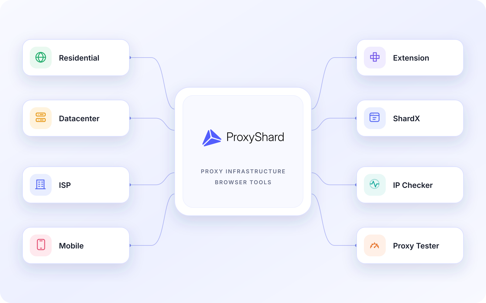

# Що таке ProxyShard

<mark style="color:purple;">**ProxyShard**</mark> поєднує резидентські, датацентрові, ISP та мобільні проксі з інструментами для роботи в браузері, перевірки й автоматизації. Датацентрові та ISP адреси закріплюються за одним клієнтом і не використовуються спільно. Доступність UDP, зміни p0f та інших функцій залежить від продукту й локації.

<figure>
  <picture>
    <source srcset=".gitbook/assets/proxyshard-products_black.svg" media="(prefers-color-scheme: dark)">
    
  </picture>
  <figcaption>
Проксі, браузерні інструменти та сервіси перевірки ProxyShard
</figcaption>
</figure>

***

## Наші продукти

### [<mark style="color:green;">Резидентські проксі</mark>](our-products/residential-proxies/)

IP-адреси домашніх і мобільних провайдерів із налаштуванням геолокації, типу сесії та параметрів підключення. Підходять для задач, де важливі різноманітність адрес і профіль звичайного користувача мережі.

### [<mark style="color:orange;">Датацентрові проксі</mark>](our-products/datacenter-proxies.md)

Швидкі статичні проксі з виділеною IP-адресою. Підходять для тривалих сесій і задач, де важливі стабільне підключення, швидкість та постійна адреса.

### [<mark style="color:blue;">ISP проксі</mark>](our-products/isp-proxies.md)

Статичні адреси в мережах інтернет-провайдерів. Вони поєднують стабільність датацентрових проксі з мережевим профілем ISP і закріплюються за одним клієнтом.

### [<mark style="color:red;">Мобільні проксі</mark>](our-products/mobile-proxies.md)

Проксі мобільних операторів із вибором країни та оператора. IP можна змінювати за посиланням, а доступні параметри залежать від вибраного тарифу й локації.

### [<mark style="color:purple;">ProxyShard Extension</mark>](our-products/proxyshard-extension.md)

Розширення для Chrome, Firefox і браузерів на Chromium. Дає змогу зберігати профілі, перемикати й перевіряти проксі, а також запускати ротацію мобільного IP за таймером або сполученням клавіш.

### [<mark style="color:purple;">ShardX Launcher</mark>](our-products/shardx-launcher.md)

Сучасний антидетект-браузер для ізольованих профілів з узгодженими відбитками та окремими проксі. Підтримує Windows, macOS і Linux, локальний HTTP API, CDP, Puppeteer, Playwright та MCP-сервер для автоматизації.

### [<mark style="color:purple;">IP Checker</mark>](our-products/ip-checker.md)

Інструмент для перевірки IP-адреси, UDP, ознак FakeISP, параметрів WebRTC і браузерного профілю. Допомагає оцінити підключення перед початком роботи.

### [<mark style="color:purple;">Proxy Tester</mark>](our-products/proxy-tester.md)

Перевіряє доступність проксі, час відповіді, вихідну IP-адресу та підтримку UDP. Підходить для швидкої перевірки однієї адреси або списку проксі.
