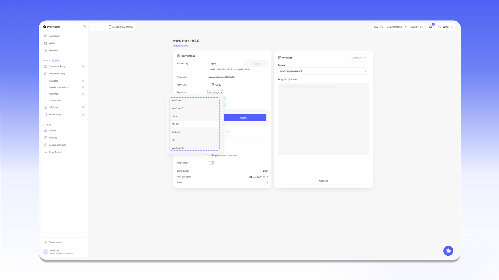

# Підміна мережевого відбитка (p0f)

## Що таке p0f і чому він важливий

Кожен пристрій у мережі має цифровий відбиток на рівні <mark style="color:$primary;">TCP/IP</mark>, який називається <mark style="color:$primary;">**p0f**</mark>. Він формується з параметрів мережевого стека: MSS, TSval, TTL, TCP options, Window size, TOS та інших. У Windows, macOS, Linux, iOS та Android ці параметри відрізняються, і антифрод-системи враховують цю різницю.

Як працює перевірка на стороні сайтів:

1. Сайт перевіряє <mark style="color:$primary;">**User-Agent**</mark>, <mark style="color:$primary;">**TLS-відбиток**</mark> та інші параметри клієнта, щоб визначити, яку ОС використовує користувач
2. Паралельно аналізується <mark style="color:$primary;">**мережевий шар**</mark> з'єднання, а саме <mark style="color:$primary;">TCP/IP-відбиток</mark>, який проксі-сервер відправляє разом із вашим трафіком
3. Якщо браузер каже "я Windows 11", а TCP/IP-відбиток видає <mark style="color:$primary;">Linux</mark>, антифрод-система фіксує невідповідність

**Поширена проблема:** Datacenter та ISP проксі зазвичай працюють на Linux-серверах. Без підміни мережевий відбиток може вказувати на Linux, навіть якщо користувач працює з Windows або macOS. Антифрод-система може розцінити таку невідповідність як ознаку використання проксі.

## Як це вирішує ProxyShard

Ми додали можливість підміни p0f-відбитка прямо з особистого кабінету. Ви вибираєте потрібну ОС, і проксі-сервер починає відправляти мережеві пакети з відповідним відбитком TCP/IP.

Доступні варіанти підміни:

| значення | Опис |
| -------------- | ------------------------------ |
| **Unset** | Стандартний відбиток (Linux) |
| **Windows 10** | Відбиток Windows 10 |
| **Windows 11** | Відбиток Windows 11 |
| **Mac OS** | Відбиток macOS |
| **Linux** | Відбиток Linux |
| **iOS** | Відбиток iOS |
| **Android** | Відбиток Android |

### ISP і Datacenter проксі

Відкрийте замовлення, натисніть `p0f` і виберіть потрібну ОС для кожної IP-адреси. Налаштування працює однаково для ISP і Datacenter проксі.

<figure>
  <picture>
    <source srcset="../.gitbook/assets/p0f-datacenter-isp_black.png" media="(prefers-color-scheme: dark)">
    
  </picture>
</figure>

### Мобільні проксі

У полі `Signature` виберіть ОС, відбитку якої має відповідати проксі. Після зміни налаштування перезапустіть проксі кнопкою `Restart`.

<figure>
  <picture>
    <source srcset="../.gitbook/assets/p0f-mobile_black.png" media="(prefers-color-scheme: dark)">
    
  </picture>
</figure>

Підміна p0f доступна не в усіх мобільних локаціях. Актуальний список наведено на сторінці [Обмеження](restrictions.md).

### Premium Residential

У Premium Residential параметр `Device OS` фільтрує проксі за операційною системою пристрою. Це фільтрація пулу, а не підміна мережевого відбитка.

<figure>
  <picture>
    <source srcset="../.gitbook/assets/p0f-premium-residential_black.png" media="(prefers-color-scheme: dark)">
    
  </picture>
</figure>

Доступність `Device OS` залежить від локації. Подробиці наведено на сторінці [Обмеження](restrictions.md).


Перед зміною p0f закрийте всі з'єднання через проксі. Старі з'єднання продовжать використовувати попередній відбиток і можуть завадити застосуванню налаштування. Після зміни p0f зачекайте 2-3 хвилини й лише потім підключайтеся.


## Реальні результати

Проміжні тести показують, що підміна p0f допомагає проходити антифрод-перевірки. Один із підтверджених сценаріїв:


**Облікові записи Google:** разом із розробником [Vision Browser](../setup-guides/antidetect-browsers/vision-browser.md) ми перевірили реєстрацію Google без зміни браузерного відбитка. У чистому профілі без підміни p0f система відразу пропонує підтвердження через QR-код. Після встановлення відбитка Windows 10 або Windows 11 QR-перевірка не з'являється, а Google пропонує підтвердження за номером телефону. Це показує, що невідповідність між браузерним і мережевим відбитками усунено.


Під час реєстрації Google на комп'ютері невідповідність браузерного й мережевого відбитків зазвичай призводить до перевірки через QR-код. Підміна p0f допомагає узгодити мережевий відбиток із вибраною операційною системою.

## Рекомендована зв'язка

Для максимального результату рекомендуємо використовувати:

* [**Vision Browser**](../setup-guides/antidetect-browsers/vision-browser.md) (антидетект-браузер з підтримкою UDP)
* **ISP-проксі від ProxyShard** з увімкненою підміною p0f

У такій конфігурації Vision Browser відповідає за браузерний відбиток, p0f за мережевий, а ISP-проксі надає IP-адресу домашнього інтернет-провайдера.

## Де доступно

Підміна p0f і фільтрування пристроїв доступні на таких продуктах:

* [Датацентрові проксі](datacenter-proxies.md)
* [ISP проксі](isp-proxies.md)
* [Мобільні проксі](mobile-proxies.md)
* [Premium Residential](residential-proxies/premium-residential.md) - фільтрування пристроїв за параметром [Device OS](residential-proxies/#nalashtuvannya-proksi), без підміни p0f


На деяких [мобільних проксі](mobile-proxies.md) підміна p0f недоступна. Повний список обмежень дивіться на сторінці [Обмеження](restrictions.md).

