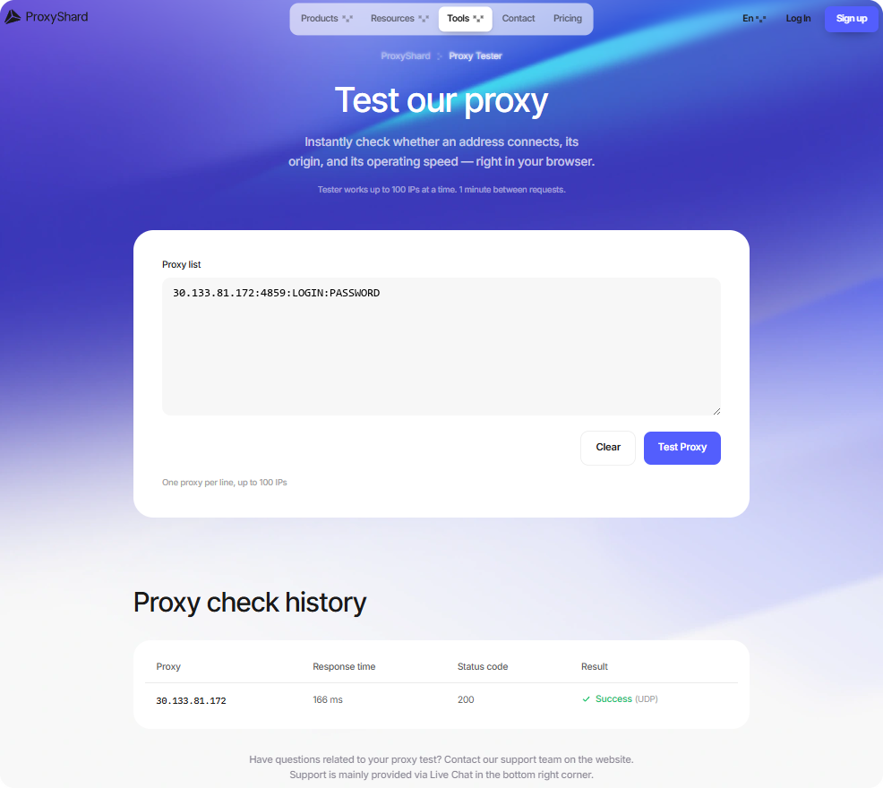

# Proxy Tester

<mark style="color:purple;">ProxyShard Proxy Tester</mark> дає змогу швидко перевірити працездатність проксі безпосередньо в браузері без встановлення додаткового програмного забезпечення. Для проксі SOCKS5 сервіс також перевіряє підтримку UDP.



***

<figure><figcaption></figcaption></figure>

## Як користуватися

1. Відкрийте [proxyshard.com/proxy-tester](https://proxyshard.com/proxy-tester)
2. Вставте один або кілька проксі в поле <mark style="color:purple;">**Proxy list**</mark>, кожен з нового рядка
3. Натисніть <mark style="color:purple;">**Test Proxy**</mark>
4. Дочекайтеся результату в таблиці <mark style="color:purple;">**Proxy check history**</mark> нижче

***

## Можливості

| Параметр | значення |
| -------------------------- | ------------------------------------------------------------------------------- |
| **Протоколи** | HTTP, SOCKS5 |
| **Максимум проксі** | до 100 штук |
| **Обмеження** | 1 запит на хвилину |
| **Підтримувані формати** | `IP:PORT:LOGIN:PASSWORD`, `LOGIN:PASSWORD@IP:PORT` та інші стандартні формати |

***

## Що показує результат

Після перевірки в таблиці <mark style="color:purple;">**Proxy check history**</mark> відображається:

| Поле | Опис |
| ----------------- | ------------------------------------------------------------------------------------------------------------------------------------------------------------------------------------------------------------------------------------------------------------- |
| **Proxy** | IP-адреса, через яку пройшло з'єднання |
| **Response time** | Час відповіді у мілісекундах. Що менше, то швидше проксі |
| **Status code** | HTTP-код відповіді. `200` означає все ок |
| **Result** | Підсумковий статус: <mark style="color:green;">**Success**</mark> (працює) або <mark style="color:red;">**Failed**</mark> (не працює). Якщо проксі підтримує UDP, поруч відображається позначка <mark style="color:purple;">**UDP**</mark> |

***

## Якщо проксі не пройшов перевірку

Не завжди це означає, що проксі несправний. Перевірте:

* Чи правильно вказані логін, пароль і порт
* Чи вибрано правильний протокол, HTTP або SOCKS5
* Чи минуло 2-3 хвилини з моменту покупки (для проксі DC/ISP може знадобитися до 2 хвилин на синхронізацію)
* Чи немає блокування з боку вашого провайдера

Якщо все правильно, але перевірка не проходить, зверніться до [служби підтримки](../contact-us.md).


Для більш детальної діагностики можна перевірити проксі через командний рядок. Докладніше: [Як перевірити працездатність проксі](../faq-and-support/faq/how-to-check-proxy.md)

