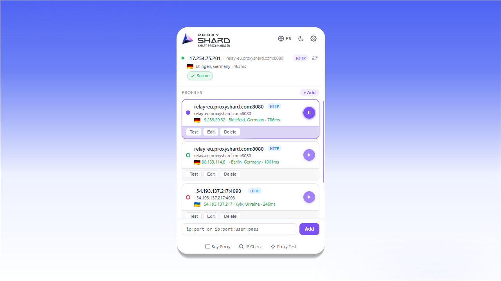
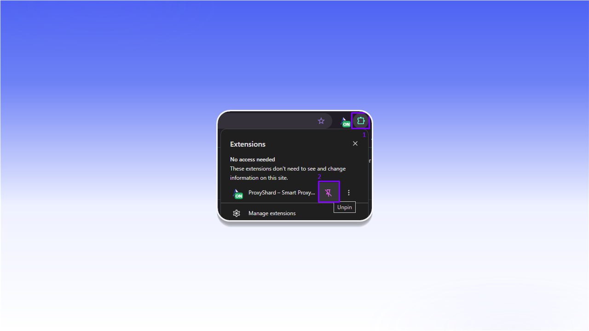
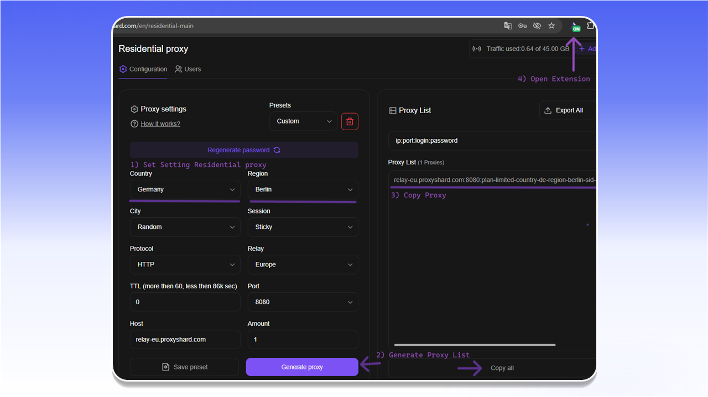
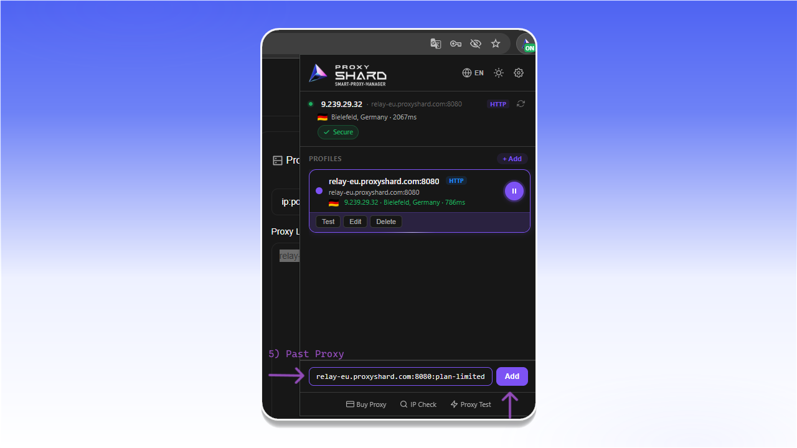
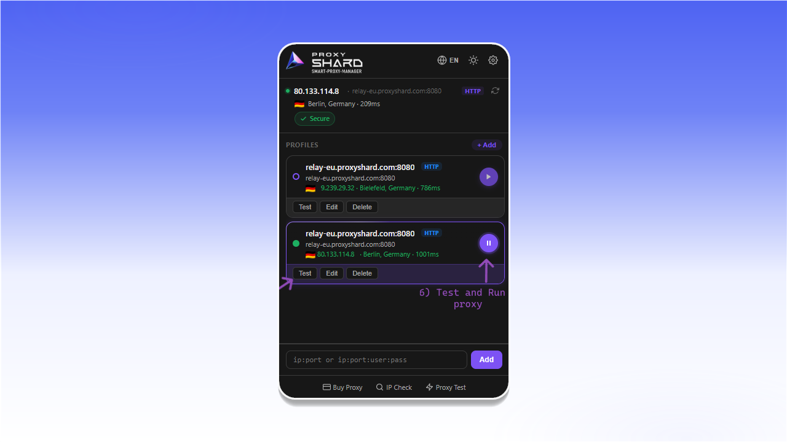
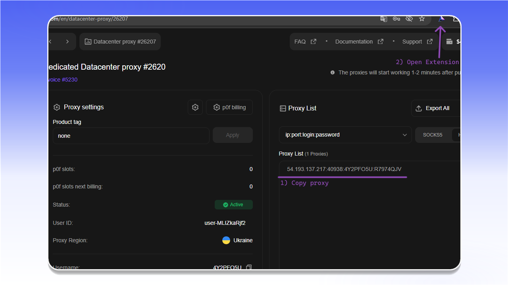
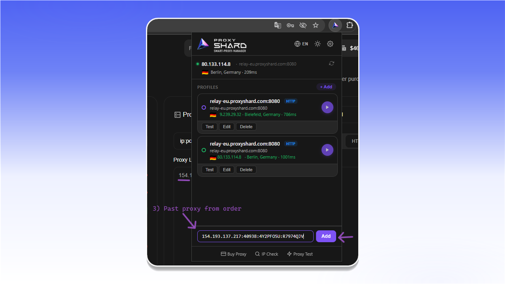
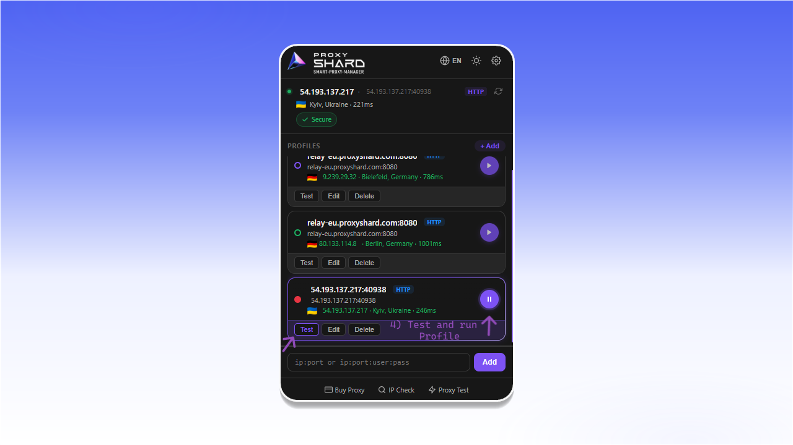
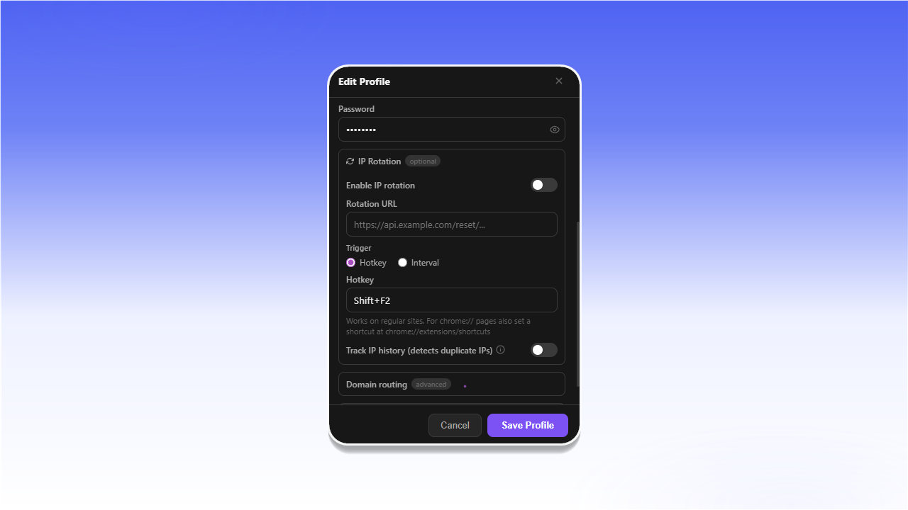
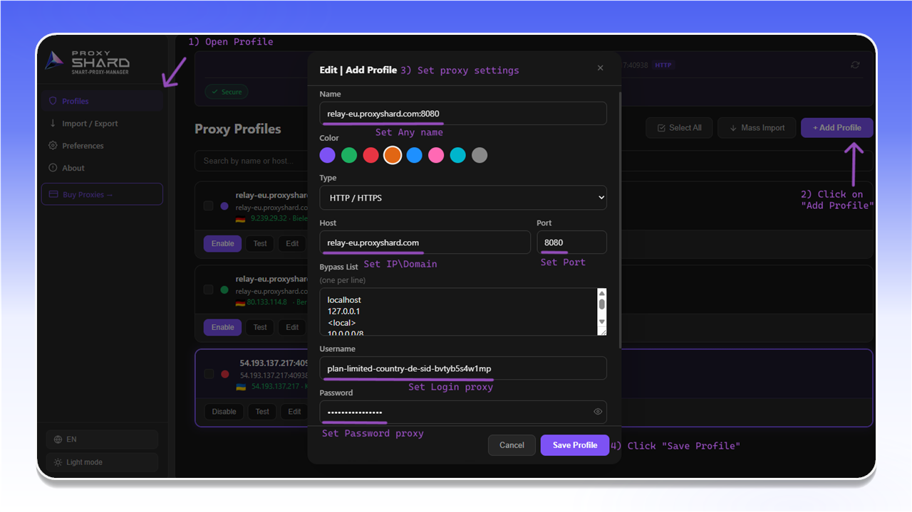

# ProxyShard Extension

<mark style="color:purple;">**ProxyShard – Smart Proxy Manager**</mark> - це наше фірмове розширення для <mark style="color:purple;">Chrome</mark>, <mark style="color:purple;">Mozilla Firefox</mark> та інших браузерів на рушії Chromium (<mark style="color:purple;">Edge</mark>, <mark style="color:purple;">Opera</mark>, <mark style="color:purple;">Brave</mark>, <mark style="color:purple;">Yandex</mark> та інших), яке дозволяє в пару кліків додавати, перемикати та тестувати проксі прямо з браузера, без сторонніх програм.

#### Що вміє розширення:

* Зберігає необмежену кількість профілів проксі
* Підтримує <mark style="color:purple;">HTTP / HTTPS</mark> з'єднання в усіх підтримуваних браузерах
* Підтримує <mark style="color:purple;">SOCKS5</mark> у версії для Mozilla Firefox
* Тестування кожного профілю «в один клік» (latency, країна, IP)
* <mark style="color:purple;">**IP-ротація за таймером або гарячою клавішею**</mark> для мобільних проксі
* Bypass-списки та просунутий routing за доменами
* Локалізація **Англійською, Російською, Українською та Китайською** мовами

<figure>
  <picture>
    <source srcset="../.gitbook/assets/extension-overview_black.png" media="(prefers-color-scheme: dark)">
    
  </picture>
  <figcaption>
Вигляд розширення ProxyShard
</figcaption>
</figure>

## Встановлення розширення

Розширення доступне в офіційних магазинах **Chrome Web Store** та **Firefox Add-ons**. Версія з Chrome Web Store також без проблем встановлюється в Edge, Opera, Brave та інші Chromium-браузери.

### Chrome, Edge, Opera, Brave, Yandex та інші Chromium-браузери

{% embed url="https://chromewebstore.google.com/detail/proxyshard-%E2%80%93-smart-proxy/ohlcikccaeapbfpmejhckfjjddkcflbe" %}

### Mozilla Firefox



Після встановлення відкрийте меню розширень (іконка пазла праворуч від адресного рядка) та **закріпіть ProxyShard** для швидкого доступу, натиснувши на іконку «шпильки» поруч із назвою розширення.

<figure>
  <picture>
    <source srcset="../.gitbook/assets/extension-pin_black.png" media="(prefers-color-scheme: dark)">
    
  </picture>
  <figcaption>
1) Відкрийте меню розширень. 2) Закріпіть ProxyShard.
</figcaption>
</figure>


**Обмеження SOCKS5 в Chromium-браузерах**

У Google Chrome (та інших браузерах на Chromium) спочатку відсутня підтримка автентифікації за логіном/паролем через SOCKS5-проксі. Для розширень на базі **Manifest V3** це обмеження зберігається.

Використовувати SOCKS5 через розширення можна лише:

* **без облікових даних** (анонімний проксі), або
* **з прив'язкою за білим списком IP-адрес**

Для проксі з авторизацією використовуйте <mark style="color:purple;">**HTTP / HTTPS**</mark> протокол, він повністю підтримується.



**SOCKS5 у Mozilla Firefox**

У версії ProxyShard Extension для Mozilla Firefox SOCKS5 працює через розширення, тому у Firefox можна використовувати SOCKS5-профілі напряму.


## Налаштування для Резидентських проксі

1. Відкрийте ваше замовлення на сторінці [**Residential proxy**](https://dashboard.proxyshard.com/residential-main) та задайте параметри проксі (країна, регіон, протокол, TTL, порт тощо).
2. Натисніть <mark style="color:purple;">**Generate proxy**</mark>, згенерований проксі з'явиться у блоці <mark style="color:purple;">Proxy List</mark> праворуч.
3. Скопіюйте рядок підключення кнопкою <mark style="color:purple;">**Copy all**</mark>.
4. Відкрийте розширення ProxyShard (закріплену іконку праворуч від адресного рядка).

<figure>
  <picture>
    <source srcset="../.gitbook/assets/extension-residential-copy_black.png" media="(prefers-color-scheme: dark)">
    
  </picture>
  <figcaption>
Кроки 1-4: налаштування та копіювання проксі з дашборда
</figcaption>
</figure>

5. У нижньому полі розширення **вставте скопійований рядок** у форматі `ip:port:login:password` і натисніть <mark style="color:purple;">**Add**</mark>.

<figure>
  <picture>
    <source srcset="../.gitbook/assets/extension-residential-add_black.png" media="(prefers-color-scheme: dark)">
    
  </picture>
  <figcaption>
Крок 5: вставка проксі та додавання профілю
</figcaption>
</figure>

6. Профіль з'явиться в списку. Натисніть <mark style="color:purple;">**Test**</mark>, щоб перевірити працездатність, та кнопку <mark style="color:purple;">**Play**</mark> для активації проксі.

<figure>
  <picture>
    <source srcset="../.gitbook/assets/extension-residential-run_black.png" media="(prefers-color-scheme: dark)">
    
  </picture>
  <figcaption>
Крок 6: тестування та запуск профілю
</figcaption>
</figure>

## Налаштування для Datacenter / ISP проксі

1. Відкрийте ваше замовлення <mark style="color:purple;">Datacenter</mark> або <mark style="color:purple;">ISP proxy</mark> на дашборді та **скопіюйте** рядок підключення з блоку <mark style="color:purple;">Proxy List</mark>.
2. Відкрийте закріплене розширення **ProxyShard**.

<figure>
  <picture>
    <source srcset="../.gitbook/assets/extension-dcisp-copy_black.png" media="(prefers-color-scheme: dark)">
    
  </picture>
  <figcaption>
Кроки 1-2: копіювання проксі із замовлення та відкриття розширення
</figcaption>
</figure>

3. У нижньому полі розширення **вставте проксі** (`ip:port:login:password`) і натисніть <mark style="color:purple;">**Add**</mark>.

<figure>
  <picture>
    <source srcset="../.gitbook/assets/extension-dcisp-add_black.png" media="(prefers-color-scheme: dark)">
    
  </picture>
  <figcaption>
Крок 3: вставка проксі в розширення
</figcaption>
</figure>

4. Натисніть <mark style="color:purple;">**Test**</mark> для перевірки та активуйте профіль кнопкою <mark style="color:purple;">**Play**</mark>.

<figure>
  <picture>
    <source srcset="../.gitbook/assets/extension-dcisp-run_black.png" media="(prefers-color-scheme: dark)">
    
  </picture>
  <figcaption>
Крок 4: тестування та запуск профілю
</figcaption>
</figure>


**Для Мобільних проксі: IP-ротація за таймером або гарячою клавішею**

При редагуванні профілю доступний блок <mark style="color:purple;">**IP Rotation**</mark>, особливо корисний для <mark style="color:purple;">мобільних проксі</mark>:

* **Rotation URL** - вставте посилання на зміну IP з вашого замовлення мобільного проксі, і розширення викликатиме його автоматично.
* **Trigger: Interval** - ротація відбуватиметься через заданий інтервал часу.
* **Trigger: Hotkey** - призначте комбінацію клавіш (наприклад, `Shift+F2`) для зміни IP «на льоту».
* **Track IP history** - функція виявлення повторів: розширення повідомить вас, якщо протягом сесії повторилася одна й та сама IP-адреса.

<figure>
  <picture>
    <source srcset="../.gitbook/assets/extension-ip-rotation_black.png" media="(prefers-color-scheme: dark)">
    
  </picture>
</figure>


## Ручне додавання профілю

Якщо ви хочете створити профіль вручну, без вставки готового рядка, використовуйте повну форму <mark style="color:purple;">**+ Add Profile**</mark>.

1. У розширенні відкрийте розділ <mark style="color:purple;">**Profiles**</mark> (через значок шестерні / налаштувань).
2. Натисніть кнопку <mark style="color:purple;">**+ Add Profile**</mark> у правому верхньому кутку.
3. Заповніть параметри профілю:
   * <mark style="color:purple;">**Name**</mark> - довільна назва профілю
   * <mark style="color:purple;">**Color**</mark> - мітка кольору для зручності
   * <mark style="color:purple;">**Type**</mark> - протокол (`HTTP / HTTPS` рекомендується)
   * <mark style="color:purple;">**Host**</mark> та <mark style="color:purple;">**Port**</mark> - адреса та порт проксі-сервера
   * <mark style="color:purple;">**Bypass List**</mark> - список IP / доменів, які повинні йти **напряму**, минаючи проксі (по одному запису на рядок)
   * <mark style="color:purple;">**Username**</mark> / <mark style="color:purple;">**Password**</mark> - дані авторизації
4. Натисніть <mark style="color:purple;">**Save Profile**</mark>.

<figure>
  <picture>
    <source srcset="../.gitbook/assets/extension-manual-profile_black.png" media="(prefers-color-scheme: dark)">
    
  </picture>
  <figcaption>
Повна форма створення профілю
</figcaption>
</figure>


**Готово!** Розширення ProxyShard повністю налаштоване і готове до роботи. Перемикайтеся між проксі «в один клік» з будь-якого підтримуваного браузера.

