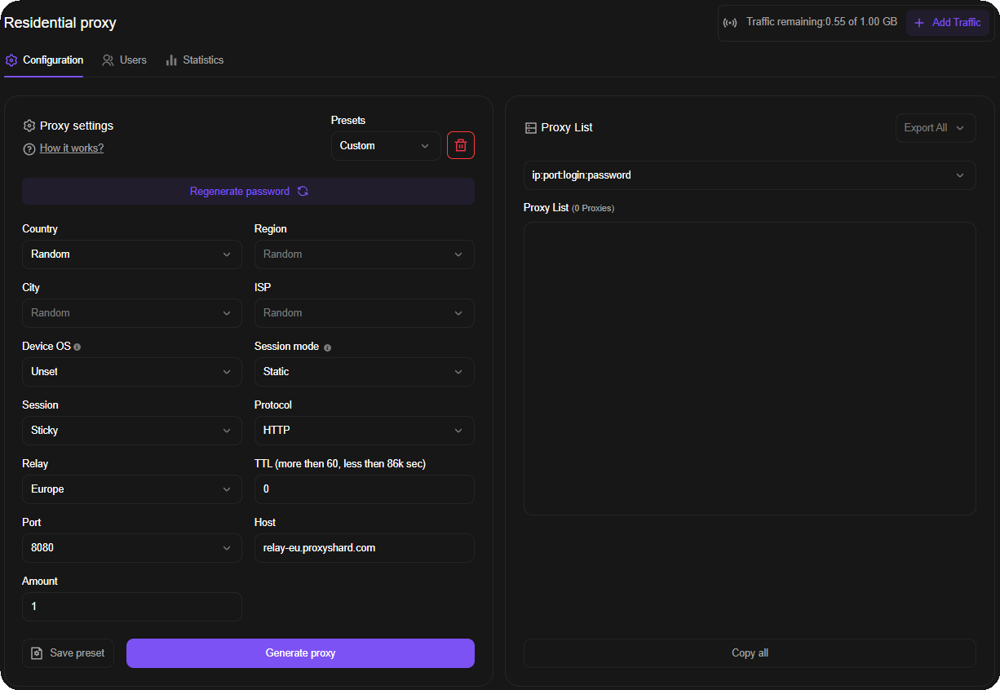

# Резидентські проксі

<mark style="color:purple;">Резидентські проксі</mark> розміщені на реальних домашніх пристроях. Ідеально підходять для роботи з безліччю IP домашніх провайдерів, підтримують тонке націлювання аж до вибору оператора.\
З обмеженнями продуктів можна ознайомитися [тут](../restrictions.md).


Невикористаний трафік не згорає наприкінці місяця: він залишається в замовленні, доки не буде використаний повністю.



Адреси видаються на реальних домашніх IP. Сесія може змінитися будь-якої миті, якщо пристрій у пулі вийде з мережі роздачі трафіку. Якщо вам потрібен **статичний IP** - дивіться [Datacenter](../datacenter-proxies.md) або [ISP проксі](../isp-proxies.md).




## Тарифи

| Параметр                | [Standard](standard-residential.md) | [Unlimited](unlimited-residential-proxy.md) | [Premium](premium-residential.md) |
| ----------------------- | ------------------------------------ | ------------------------------------------- | --------------------------------- |
| Розмір пулу             | 300k - 400k                          | 300k - 400k (= Standard)                    | 3.8M - 4.6M                       |
| Макс. з'єднань          | 35 000                               | 5 000                                       | -                                 |
| Макс. швидкість         | 75 Mbps                              | 75 Mbps                                     | 75 Mbps                           |
| [Підтримка UDP](../about-udp/) | ✓ (крім США)                         | ✓ (крім США)                                | ✗                                 |
| [Фільтрація Device OS (p0f)](README.md#opis-poliv-nalashtuvan) | ✗ | ✗ | ✓ |
| Безлімітний тариф       | ✗                                    | ✓                                           | ✗                                 |
| Тарифікація             | За ГБ (Pay as you go)                | День / Пів місяця / Місяць                  | За ГБ (Pay as you go)             |
| Вартість                | **$2 / ГБ**                          | **$30** / д · **$399** / пів міс. · **$699** / міс. | **$3 / ГБ**                 |

## Доступні країни

### Standard і Unlimited Residential

Доступно **165 країн** і варіант `Random` для автоматичного вибору країни.


[available-countries.md](available-countries.md)


### Premium Residential

Доступно **214 країн**.


[premium-available-countries.md](premium-available-countries.md)


## **Як почати використовувати?**

Розрахунок вартості резидентських проксі здійснюється від кількості придбаних гігабайт на замовлення.
\
Щоб отримати доступ до вибору країни та інших параметрів, потрібно [**придбати**](https://dashboard.proxyshard.com/en/residential-main) замовлення. Для цього перейдіть на сторінку .png>) і вкажіть кількість гігабайтів\
 

<figure><figcaption></figcaption></figure>

## Опис полів налаштувань

У самому замовленні є кілька важливих пунктів і опцій. Розглянемо їх.

<figure><figcaption></figcaption></figure>

<mark style="color:purple;">**Traffic used**</mark> - Скільки витрачено \ Скільки придбано

<mark style="color:purple;">**Country**</mark> - Вибір країни

<mark style="color:purple;">**Region**</mark> - Вибір регіону країни

<mark style="color:purple;">**City**</mark> - Вибір міста регіону

<mark style="color:purple;">**ISP**</mark> - Вибір типу провайдера. Доступний лише для [Premium Residential](premium-residential.md).

[**Device OS**](../p0f-spoofing.md) - Фільтрація пулу [Premium Residential](premium-residential.md) за операційною системою пристрою. Виберіть потрібну ОС, щоб отримувати проксі від пристроїв із відповідним типом ОС. Доступна лише для Premium Residential.


Цей параметр значно скорочує пул доступних пристроїв. Рекомендуємо використовувати його лише для таргетингу на міста з населенням понад 1 млн осіб або на рівні країни чи регіону.


<mark style="color:purple;">**Session**</mark> - Вибір типу сесії, на вибір дається <mark style="color:purple;">Sticky</mark> та <mark style="color:purple;">Rotate</mark>.

* <mark style="color:purple;">Sticky</mark> дозволяє утримати одну IP адресу і залежить від вибраного параметра TTL.
* <mark style="color:purple;">Rotate</mark> змінює IP при кожному зверненні. Пул IP діапазонів у <mark style="color:purple;">Sticky</mark> менший, ніж у <mark style="color:purple;">Rotate</mark>

<mark style="color:purple;">**Session mode**</mark> - Параметр керування сесією, доступний лише для [Premium Residential](premium-residential.md).

* <mark style="color:purple;">Default (5 sec)</mark> змінює сесію, якщо пристрій не відповідає понад 5 секунд.
* <mark style="color:purple;">Static</mark> не змінює сесію та очікує повернення пристрою в мережу протягом часу, вказаного в TTL. Якщо TTL не задано, сесія фіксується на один день.

<mark style="color:purple;">**Protocol**</mark> - HTTP/SOCKS.\
Це основні протоколи для встановлення з'єднання із сервером проксі.

<mark style="color:purple;">**TTL**</mark> - З'являється при виборі <mark style="color:purple;">Session - Sticky</mark> та відповідає за час життя IP адреси (<mark style="color:purple;">Time to live</mark>). Мінімально можливий <mark style="color:purple;">TTL</mark> - 60 секунд (1 хвилина).

<mark style="color:purple;">**Relay**</mark> **-** Встановлюється лише у випадках, якщо немає підключення

<mark style="color:purple;">**Username\Password\Host\Port**</mark> - Дані для підключення також формуються в списку проксі і підтримують умовне форматування.


Порти на проксі не впливають на кінцеву адресу, що отримується, це просто номер порту для віддаленого сервера проксі і не більше того!


<mark style="color:purple;">**Traffic Statistics**</mark> - Похвилинна статистика використаного трафіку. Є затримка у відображенні 10-20 хвилин.

<figure><figcaption></figcaption></figure>

Наприкінці замовлення, ви можете виявити статистику запитів з вашого резидентського трафіку, в окремих випадках можуть бути затримки у відображенні до 20 хвилин.

## **Інструкція з налаштування**

1. Вкажіть налаштування - <mark style="color:purple;">Країна</mark>, <mark style="color:purple;">Регіон</mark> та інші параметри при необхідності

<figure><figcaption></figcaption></figure>

2. Протокол <mark style="color:purple;">HTTP</mark> або <mark style="color:purple;">SOCKS5</mark> встановлюється за вашим бажанням <mark style="color:$info;">(як правило для роботи UDP встановлюють SOCKS5)</mark>

<figure><figcaption></figcaption></figure>

3. Сервер (<mark style="color:purple;">Relay</mark>) вказується лише при проблемах з підключенням

<figure><figcaption></figcaption></figure>

4. Інші параметри встановлюються за необхідності

<figure><figcaption></figcaption></figure>

5. Натиснути кнопку  та скопіювати проксі з <mark style="color:purple;">Proxy List</mark>

<figure><figcaption></figcaption></figure>

В подальшому, якщо вам потрібна інша країна, потрібно вказати нові налаштування і натиснути  і повторно встановити нові проксі в програму, звідки здійснюється підключення.


Додаткову інформацію про форматування підключення можна дізнатися за посиланням 



Проксі в Proxy List не зберігаються, оскільки це динамічне поле. Можна згенерувати багато проксі різних локацій - старі при генерації нових проксі не перестануть працювати.


## Для яких завдань підходить

Соціальні мережі та мультиакаунтинг, криптобіржі (Binance, Bybit та інші), Polymarket, web scraping, SEO моніторинг, перевірка реклами (ad verification), e-commerce аналітика, моніторинг цін, геотаргетоване тестування сайтів.

## Плюси та мінуси Резидентських проксі

#### <mark style="color:green;">Плюси:</mark>

* **Гнучка тарифікація** - Pay as you go або безлімітна підписка (Unlimited)
* **Зміна IP** - ротація адрес за вимогою або за таймером (TTL)
* **Широкий геотаргетинг** - вибір країни, регіону, міста та оператора
* **Адреси домашнього походження** - IP зареєстровані на домашніх провайдерах
* **Підтримка UDP** - доступна на Standard та Unlimited (крім локації США)

#### <mark style="color:red;">Мінуси:</mark>

* **Можливі просідання швидкості** - залежить від якості інтернету на кінцевому пристрої, це специфіка продукту
* **Динамічний IP** - довільна зміна адреси можлива будь-якої миті; якщо потрібен статичний IP - дивіться [ISP](../isp-proxies.md) або [Datacenter](../datacenter-proxies.md)
* **Підміна p0f недоступна** - на Premium Residential доступна лише [фільтрація пристроїв за Device OS](README.md#opis-poliv-nalashtuvan)
* **UDP недоступний у локації США** на Standard та Unlimited


Немає UDP чи потрібна статична адреса? [ISP проксі](../isp-proxies.md) закривають обидва пункти.



Про те, як можна налаштувати проксі, ви можете у нашому розділі "[Інструкція з використання ](../../setup-guides/getting-started.md)"

