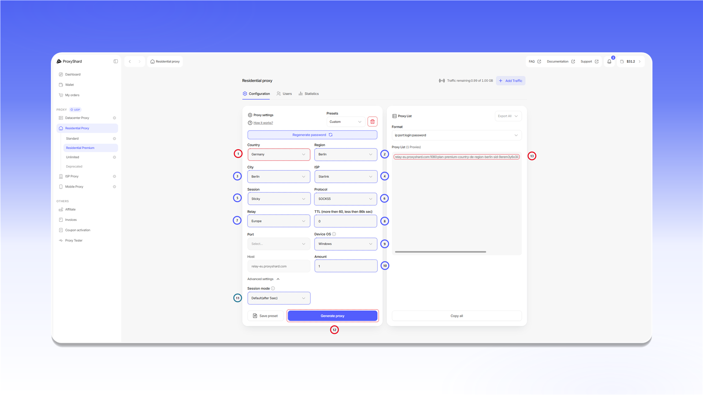

# Резидентські проксі

<mark style="color:purple;">Резидентські проксі</mark> розміщені на реальних домашніх пристроях. Ідеально підходять для роботи з безліччю IP домашніх провайдерів, підтримують тонке націлювання аж до вибору оператора.\
З обмеженнями продуктів можна ознайомитися [тут](../restrictions.md).


Невикористаний трафік не згорає наприкінці місяця: він залишається в замовленні, доки не буде використаний повністю.



Адреси видаються на реальних домашніх IP. Сесія може змінитися будь-якої миті, якщо пристрій у пулі вийде з мережі роздачі трафіку. Якщо вам потрібен **статичний IP** - дивіться [Datacenter](../datacenter-proxies.md) або [ISP проксі](../isp-proxies.md).




Покрокова інструкція з придбання та оплати: [Придбання резидентських проксі](../../site-navigation/buying-and-renewing/buying-residential-proxies.md).

## Тарифи

| Параметр                | [Standard](standard-residential.md) | [Unlimited](unlimited-residential-proxy.md) | [Premium](premium-residential.md) |
| ----------------------- | ------------------------------------ | ------------------------------------------- | --------------------------------- |
| Розмір пулу             | 300k - 400k                          | 300k - 400k (= Standard)                    | 3.8M - 4.6M                       |
| Макс. з'єднань          | 35 000                               | 5 000                                       | -                                 |
| Макс. швидкість         | 75 Mbps                              | 75 Mbps                                     | 75 Mbps                           |
| [Підтримка UDP](../about-udp/) | ✓ (крім США; діють обмеження портів) | ✓ (крім США; діють обмеження портів) | ✓ (крім окремих міст і пристроїв macOS/iOS) |
| [Фільтрація Device OS](../p0f-spoofing.md) | ✗ | ✗ | ✓ |
| Безлімітний тариф       | ✗                                    | ✓                                           | ✗                                 |
| Тарифікація             | За ГБ (Pay as you go)                | День / Пів місяця / Місяць                  | За ГБ (Pay as you go)             |
| Вартість                | **$2 / ГБ**                          | **$30** / д · **$399** / пів міс. · **$699** / міс. | **$3 / ГБ**                 |

## Доступні країни

### Standard і Unlimited Residential

Доступно **165 країн** і варіант `Random` для автоматичного вибору країни.


[available-countries.md](available-countries.md)


### Premium Residential

Доступно **214 країн**.


[premium-available-countries.md](premium-available-countries.md)


## Як придбати

1. У розділі `Residential Proxy` виберіть план `Standard`, `Residential Premium` або `Unlimited`.
2. Для плану з оплатою за трафік укажіть кількість гігабайтів.
3. Якщо у вас є промокод, введіть його в `Promocode` і натисніть `Apply`.
4. Перевірте вартість і натисніть `Buy now`.

<figure>
  <picture>
    <source srcset="../../.gitbook/assets/residential-purchase-form_black.png" media="(prefers-color-scheme: dark)">
    
  </picture>
</figure>

Оплата замовлення та поповнення трафіку описані в інструкції [Придбання резидентських проксі](../../site-navigation/buying-and-renewing/buying-residential-proxies.md).

## Налаштування проксі

Для звичайного підключення достатньо вибрати `Country` і натиснути `Generate proxy`. Інші параметри потрібні для точнішого таргетингу та керування сесією.

<figure>
  <picture>
    <source srcset="../../.gitbook/assets/residential-settings_black.png" media="(prefers-color-scheme: dark)">
    
  </picture>
</figure>

1. `Country` вибирає країну.
2. `Region` вибирає регіон у межах країни.
3. `City` вибирає місто.
4. `ISP` фільтрує адреси за провайдером. Поле доступне лише для [Premium Residential](premium-residential.md).
5. `Session` задає режим ротації. `Sticky` утримує одну IP-адресу в межах `TTL`, а `Rotate` змінює IP під час кожного запиту.
6. `Protocol` вибирає `HTTP` або `SOCKS5`.
7. `Relay` змінює сервер підключення. Використовуйте його лише за наявності проблем зі з'єднанням.
8. `TTL` задає час життя IP для сесії `Sticky`. Мінімальне значення становить 60 секунд.
9. `Device OS` фільтрує пул [Premium Residential](premium-residential.md) за операційною системою пристрою.
10. `Amount` задає кількість рядків, які буде створено за один раз.
11. `Session mode` керує сесіями Premium Residential. `Default(after 5sec)` перемикає сесію, якщо пристрій не відповідає понад п'ять секунд. `Static` очікує повернення того самого пристрою протягом `TTL`.
12. `Generate proxy` створює рядки підключення з вибраними параметрами.
13. `Proxy List` показує створені рядки. Через `Format` можна вибрати їхній формат, а через `Copy all` скопіювати весь список.

`Presets` зберігає набори налаштувань для повторного використання. Налаштуйте поля, натисніть `Save preset` і виберіть збережений набір під час наступної генерації.


Одночасний вибір `Device OS`, міста та провайдера значно скорочує доступний пул. У країнах Tier 2 і Tier 3 може не бути відповідних пристроїв із macOS або iOS.



Якщо використовується нестандартний `Session mode`, рядок може припинити відповідати після виходу вибраного пристрою з мережі. У такому разі створіть новий рядок через `Generate proxy`.



`Regenerate password` змінює пароль замовлення та одразу робить недійсними всі раніше створені рядки. Використовуйте цю функцію, лише якщо дані авторизації могли потрапити до сторонніх. Для контролю трафіку окремих користувачів використовуйте вкладку `Users`.


`Proxy List` є динамічним полем, а не сховищем. Раніше створені рядки продовжують працювати, оскільки вибрані параметри записані в `Username`. Для збереження самих налаштувань використовуйте `Presets`.

## Формат рядка підключення

Стандартний формат має такий вигляд:

```text
host:port:username:password
```

* `host` указує сервер підключення, наприклад `relay-eu.proxyshard.com`.
* `port` використовується для підключення до сервера та сам по собі не визначає кінцеву IP-адресу.
* `username` містить параметри таргетингу та ідентифікатор сесії `sid`.
* `password` використовується для авторизації.

Готовий рядок можна додати до браузера, програми чи іншого клієнта. Покрокові приклади зібрані в [інструкціях із налаштування](../../setup-guides/getting-started.md).

## Статистика

<figure>
  <picture>
    <source srcset="../../.gitbook/assets/residential-statistics_black.png" media="(prefers-color-scheme: dark)">
    
  </picture>
</figure>

1. Відкрийте вкладку `Statistics`.
2. Виберіть період для графіка `Traffic Statistics`.
3. Окремо виберіть період для таблиці `Requests Statistics`.

Нові дані можуть з'являтися із затримкою 10-20 хвилин. Статистика зберігається один місяць.

## Для яких завдань підходить

Соціальні мережі та мультиакаунтинг, криптобіржі (Binance, Bybit та інші), Polymarket, web scraping, SEO моніторинг, перевірка реклами (ad verification), e-commerce аналітика, моніторинг цін, геотаргетоване тестування сайтів.

## Плюси та мінуси Резидентських проксі

#### <mark style="color:green;">Плюси:</mark>

* **Гнучка тарифікація** - Pay as you go або безлімітна підписка (Unlimited)
* **Зміна IP** - ротація адрес за вимогою або за таймером (TTL)
* **Широкий геотаргетинг** - вибір країни, регіону, міста та оператора
* **Адреси домашнього походження** - IP зареєстровані на домашніх провайдерах
* **Підтримка UDP** - доступна на Standard, Unlimited і Premium з урахуванням обмежень продукту

#### <mark style="color:red;">Мінуси:</mark>

* **Можливі просідання швидкості** - залежить від якості інтернету на кінцевому пристрої, це специфіка продукту
* **Динамічний IP** - довільна зміна адреси можлива будь-якої миті; якщо потрібен статичний IP - дивіться [ISP](../isp-proxies.md) або [Datacenter](../datacenter-proxies.md)
* **Підміна p0f недоступна** - на Premium Residential доступна лише [фільтрація пристроїв за Device OS](../p0f-spoofing.md)
* **Обмеження UDP** - Standard і Unlimited не підтримують UDP у США, а на Premium є винятки для окремих міст і пристроїв macOS/iOS. Також діють загальні [обмеження портів](../restrictions.md)


Потрібна статична адреса з UDP? Обирайте [ISP проксі](../isp-proxies.md).



Приклади налаштування проксі зібрані в розділі [Інструкція з використання](../../setup-guides/getting-started.md).

