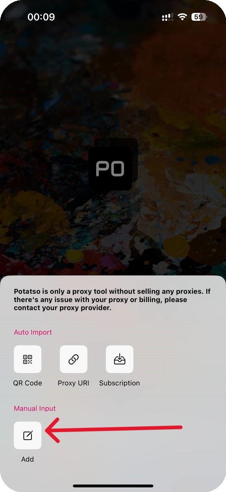

# Potatso

## Установка Potatso

Завантажте програму



## Налаштування Potatso

Потім відкрийте програму та додайте проксі

<figure><figcaption></figcaption></figure>

Створіть нову конфігурацію

<figure><figcaption></figcaption></figure>

## Налаштування профілю

Вкажіть із замовлення ваші проксі, вибравши тип підключення

<figure><figcaption></figcaption></figure>


**З прикладом налаштування проксі ви можете ознайомитись у розділі [Інструкція з налаштування](../getting-started.md)**


Збережіть налаштування та запустіть програму

<figure><figcaption></figcaption></figure>

**Готово! Ви закінчили налаштування проксі через програму "Potatso".**\
**Тепер ви можете розпочати використання наших проксі.**
