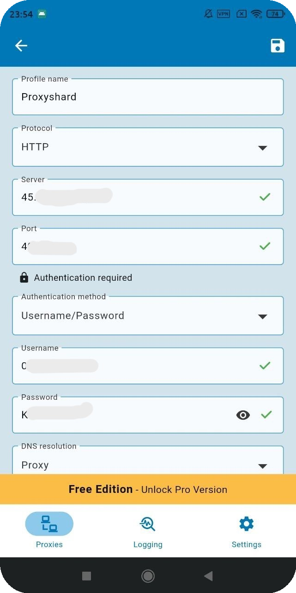
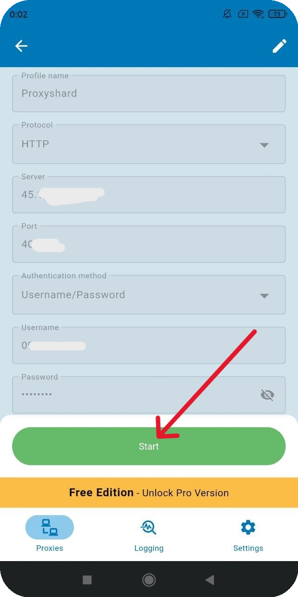

# Super Proxy

## Налаштування Super Proxy

Завантажте програму через посилання:



## Створення профілю

Потім відкрийте програму та додайте проксі через "<mark style="color:purple;">Add proxy</mark>"

<figure><figcaption></figcaption></figure>

З замовлення встановіть проксі у відповідні поля та вкажіть тип протоколу підключення

<figure><figcaption></figcaption></figure>


**З прикладом налаштування проксі ви можете ознайомитись у розділі [Інструкція з налаштування](../getting-started.md)**


Збережіть налаштування та запустіть програму

<figure><figcaption></figcaption></figure>

**Готово! Ви закінчили налаштування проксі через програму "Potatso".**\
**Тепер ви можете розпочати використання наших проксі.**

