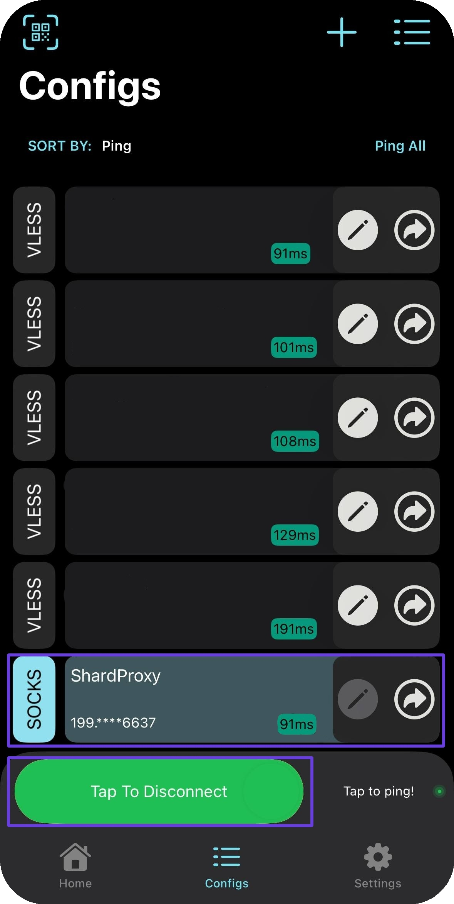

# 🔥 V2Box


Дане рішення підтримує тунелювання UDP!


## Установка V2Box

Перейдіть в App Store/Google play і завантажте програму V2BOX

#### <mark style="color:green;">Android</mark>



#### <mark style="color:blue;">**iOS**</mark>



## Налаштування V2Box

Відкрийте програму та перейдіть у вкладку "<mark style="color:purple;">Configs</mark>" і через "➕" створіть нову конфігурацію

<figure><figcaption></figcaption></figure>

<figure><figcaption></figcaption></figure>

Вкажіть тип підключення <mark style="color:purple;">SOCKS</mark>

<figure><figcaption></figcaption></figure>

Із замовлення вкажіть ваші проксі у поля програми

<figure><figcaption></figcaption></figure>


**З прикладом налаштування проксі ви можете ознайомитись у розділі [Інструкція з налаштування](../getting-started.md)**


Збережіть вашу конфігурацію та перейдіть назад у "<mark style="color:purple;">Configs</mark>", в ньому обов'язково потрібно натиснути на ваш конфіг і підключиться  

<figure><figcaption></figcaption></figure>

\
**Готово! Тепер ви можете перевірити проксі на нашому** [**чекері**](https://proxyshard.com/proxy-tester)
