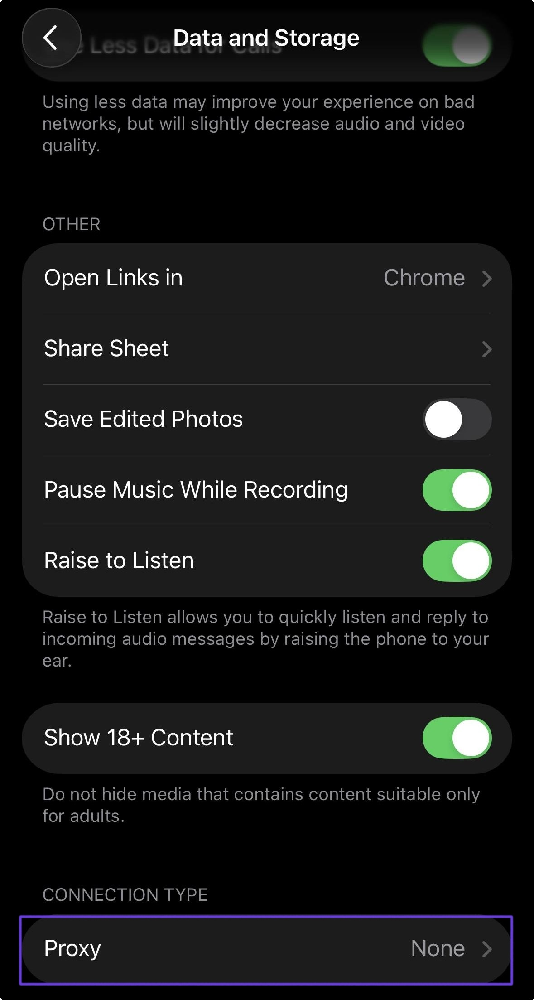

# Telegram

### Налаштування проксі для Desktop версії Telegram

Щоб настроїти проксі в <mark style="color:purple;">Telegram</mark>, перейдіть до пункту Settings.

<figure><figcaption></figcaption></figure>

Потім відкрийте "Розширені" налаштування

<figure><figcaption></figcaption></figure>

Виберіть тип підключення "TCP"

<figure><figcaption></figcaption></figure>

Далі вкажіть підключення до проксі

Виберіть зручний для вас протокол підключення, за замовчуванням це HTTP


**З прикладом налаштування проксі ви можете ознайомитись у розділі [Інструкція з налаштування](getting-started.md)**


<figure><figcaption></figcaption></figure>

Потім перевірте підключення та збережіть

<figure><figcaption></figcaption></figure>

**Готово! Тепер ви можете користуватись Telegram з нашими проксі.**

### Налаштування проксі для мобільної версії Telegram

Для налаштування проксі на телефоні потрібно відкрити налаштування та вибрати пункт "Data and Storage"

<figure><figcaption></figcaption></figure>

Після вибрати пункт "Proxy"

<figure><figcaption></figcaption></figure>

Вкажіть протокол SOCKS5 та впишіть дані для підключення до проксі

<figure><figcaption></figcaption></figure>

Обов'язково збережіть налаштування і далі можна використовувати проксі всередині _Telegram._

