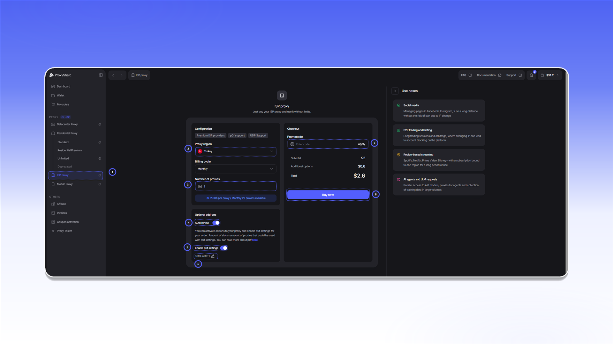

# Придбання ISP-проксі


Для оплати замовлення на балансі мають бути [кошти](../top-up-balance.md).


## Придбання проксі

Щоб придбати [ISP-проксі](https://dashboard.proxyshard.com/isp-proxy):

1. Відкрийте розділ `ISP Proxy`.
2. У полі `Proxy region` виберіть країну проксі.
3. У полі `Billing cycle` виберіть період оплати.
4. У полі `Number of proxies` укажіть кількість проксі.
5. Увімкніть `Auto renew`, якщо хочете автоматично продовжувати замовлення.
6. За потреби увімкніть `Enable p0f settings` і вкажіть кількість слотів у полі `Total slots`.
7. Якщо у вас є промокод, введіть його в поле `Promocode` і натисніть `Apply`.
8. Перевірте вартість замовлення та натисніть `Buy now`.

<figure>
  <picture>
    <source srcset="../../.gitbook/assets/isp-purchase-form_black.png" media="(prefers-color-scheme: dark)">
    
  </picture>
</figure>

## Оплата й активація

Після натискання `Buy now` відкриється рахунок зі статусом `Unpaid`. Перевірте суму в рядку `Total amount`, потім натисніть `Pay with Wallet`. Оплата відбувається так само, як в [інструкції для датацентрових проксі](buying-datacenter-proxies.md#oplata-zamovlennya).

Після оплати замовлення з'явиться в блоці `Active products` і в розділі [`My orders`](https://dashboard.proxyshard.com/products).


Проксі стануть доступними протягом 1-2 хвилин, поки замовлення синхронізується.


## Керування та продовження замовлення

<figure>
  <picture>
    <source srcset="../../.gitbook/assets/isp-order-details_black.png" media="(prefers-color-scheme: dark)">
    
  </picture>
</figure>

Якщо ввімкнено `Auto renew`, система спробує продовжити замовлення за 1-2 години до завершення поточного платіжного періоду. За достатнього балансу кошти спишуться автоматично.

Якщо автоматичне продовження вимкнено або на балансі недостатньо коштів, замовлення отримає статус `On-hold`. Для ручного продовження відкрийте замовлення, натисніть `Renew` і сплатіть рахунок.

Опис `Status`, `Product tag`, даних доступу, налаштувань p0f та інших полів наведено в розділі [Поля замовлення](../../our-products/isp-proxies.md#polya-zamovlennya).


Замовлення зі статусом `Canceled` продовжити не можна. Неоплачене замовлення переходить у цей статус через три дні.

