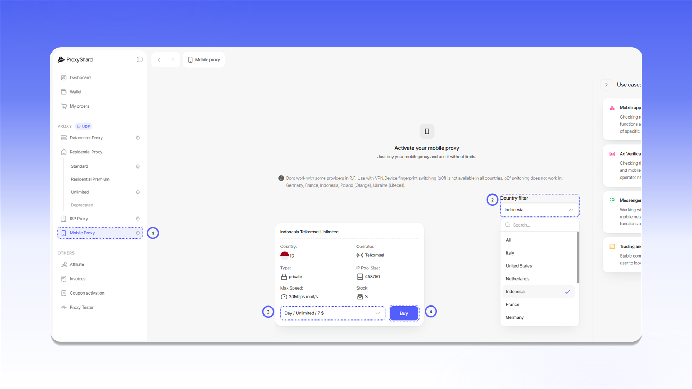

# Придбання мобільних проксі

## Купівля проксі

Щоб оформити замовлення:

1. Відкрийте розділ `Mobile Proxy`.
2. Виберіть країну за допомогою `Country filter`.
3. У картці потрібного оператора виберіть період оренди.
4. Натисніть `Buy`.

<figure>
  <picture>
    <source srcset="../../.gitbook/assets/mobile-purchase-form_black.png" media="(prefers-color-scheme: dark)">
    
  </picture>
</figure>

## Оплата замовлення

Перевірте суму рахунку та натисніть `Pay with Wallet`.

<figure>
  <picture>
    <source srcset="../../.gitbook/assets/mobile-invoice-payment_black.png" media="(prefers-color-scheme: dark)">
    
  </picture>
</figure>

Після оплати замовлення з'явиться в блоці `Active products` і в розділі [`My orders`](https://dashboard.proxyshard.com/products). Натисніть `Open`, щоб перейти до його налаштувань.

<figure>
  <picture>
    <source srcset="../../.gitbook/assets/mobile-active-products_black.png" media="(prefers-color-scheme: dark)">
    
  </picture>
</figure>

## Початок роботи

Щоб активувати проксі після придбання, скопіюйте `Reset URL` і відкрийте посилання або натисніть `Restart`.

<figure>
  <picture>
    <source srcset="../../.gitbook/assets/mobile-order-restart_black.png" media="(prefers-color-scheme: dark)">
    
  </picture>
</figure>


Після трьох годин бездіяльності проксі стає неактивним. Щоб відновити роботу, знову відкрийте `Reset URL` або натисніть `Restart`.


Опис налаштувань і полів замовлення доступний у [розділі про мобільні проксі](../../our-products/mobile-proxies.md).

## Продовження замовлення

Якщо ввімкнено `Auto renew`, замовлення продовжується автоматично за умови достатнього балансу. Якщо автоматичне продовження вимкнено, після завершення оплаченого періоду замовлення отримає статус `On-hold`. Відкрийте замовлення та натисніть `Renew`, щоб продовжити його вручну.

<figure>
  <picture>
    <source srcset="../../.gitbook/assets/mobile-order-renewal_black.png" media="(prefers-color-scheme: dark)">
    
  </picture>
</figure>


Замовлення зі статусом `Canceled` продовжити не можна. Цей статус призначається через три дні після несплати замовлення.

