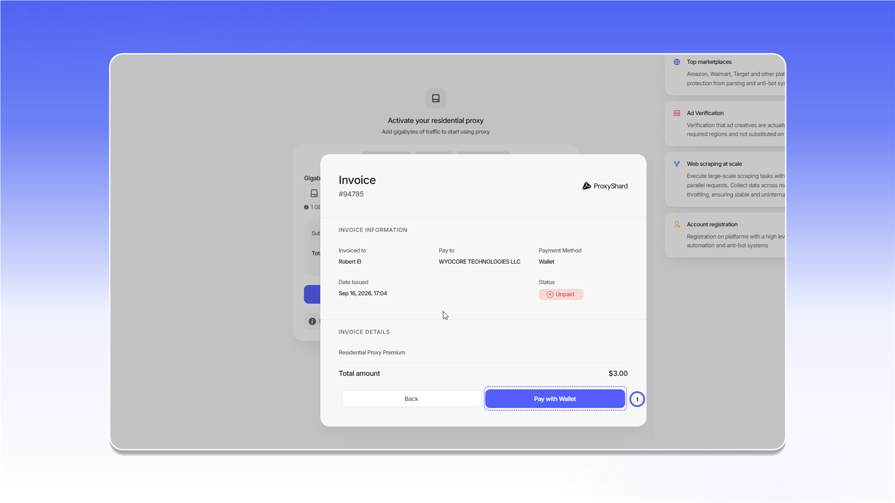
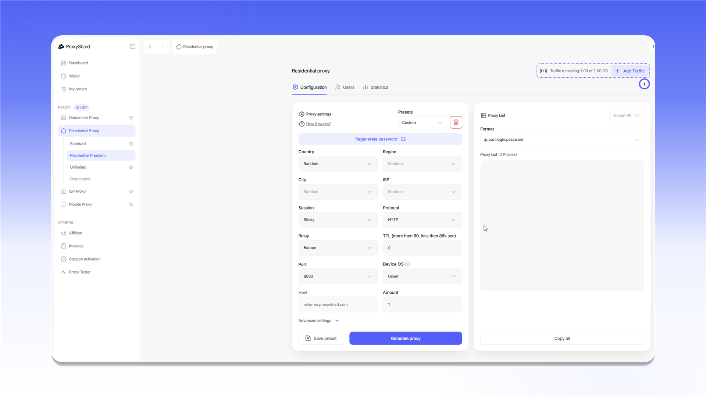

# Придбання резидентських проксі

## Купівля проксі

Перед придбанням виберіть відповідний план: `Standard`, `Residential Premium` або `Unlimited`. Відмінності між планами наведено в [таблиці порівняння](../../our-products/residential-proxies/).

Щоб оформити замовлення:

1. Виберіть план у розділі `Residential Proxy`.
2. Для плану з оплатою за трафік укажіть кількість гігабайтів.
3. Якщо у вас є промокод, введіть його в поле `Promocode` і натисніть `Apply`.
4. Перевірте вартість і натисніть `Buy now`.


Невикористаний трафік не згорає наприкінці місяця. Він залишається в замовленні, доки не буде використаний повністю.


<figure>
  <picture>
    <source srcset="../../.gitbook/assets/residential-purchase-form_black.png" media="(prefers-color-scheme: dark)">
    
  </picture>
</figure>

## Оплата замовлення

Після натискання `Buy now` відкриється рахунок зі статусом `Unpaid`. Перевірте суму в рядку `Total amount` і натисніть `Pay with Wallet`.

<figure>
  <picture>
    <source srcset="../../.gitbook/assets/residential-invoice-payment_black.png" media="(prefers-color-scheme: dark)">
    
  </picture>
</figure>

Після оплати відкриється панель налаштування та генерації проксі. Опис параметрів замовлення доступний у [розділі про резидентські проксі](../../our-products/residential-proxies/#opis-poliv-nalashtuvan).

## Поповнення трафіку в замовленні

Відкрийте замовлення та натисніть `Add Traffic` поруч із залишком трафіку. Виберіть потрібний обсяг і сплатіть виставлений рахунок з балансу.

<figure>
  <picture>
    <source srcset="../../.gitbook/assets/residential-add-traffic_black.png" media="(prefers-color-scheme: dark)">
    
  </picture>
</figure>

Після оплати додатковий трафік буде додано до замовлення. Якщо проксі зупинилися через нульовий залишок, вони знову стануть доступними.
