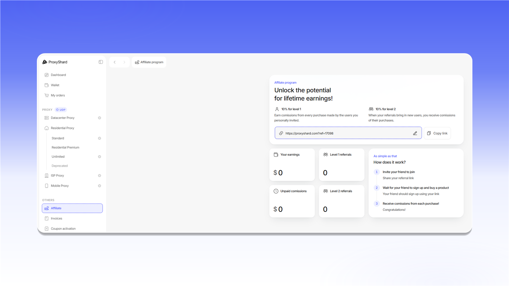

# Реферальна програма

У розділі `Affiliate` міститься персональне реферальне посилання. Скопіюйте його за допомогою `Copy link` і передайте користувачеві, якого хочете запросити.

За покупки запрошених вами користувачів нараховується комісія 10% першого рівня. Якщо запрошений користувач залучить нового клієнта, ви також отримаєте комісію 10% другого рівня з його покупок.

Щоб змінити закінчення реферального посилання, натисніть значок олівця поруч із ним і збережіть нове значення. На цій самій сторінці відображаються нарахування, невиплачена комісія та кількість рефералів кожного рівня.

<figure>
  <picture>
    <source srcset="../.gitbook/assets/affiliate-program_black.png" media="(prefers-color-scheme: dark)">
    
  </picture>
</figure>


Технічна підтримка не розкриває додаткові відомості про переходи за посиланням і нарахування комісії.

