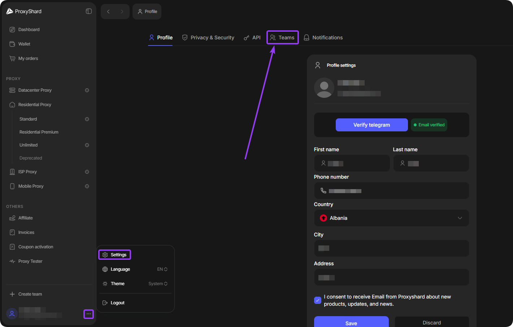

# Команди

Розділ Teamspaces дає змогу працювати з іншими користувачами, ділитися доступом до проксі, призначати ролі та керувати замовленнями в спільному робочому просторі.

## Відкриття розділу команд

1. Натисніть на іконку профілю в нижньому лівому куті дашборду.
2. Виберіть **Settings**, потім відкрийте вкладку **Teams** у верхній навігації.

<figure><figcaption></figcaption></figure>

## Керування командами

На вкладці **Teams** відображаються створені вами команди та команди, до яких ви входите. Можна створити до 10 команд.

У командах, де ви є учасником, доступні кнопки для перемикання активної команди та виходу з неї.

<figure><figcaption></figcaption></figure>

У створених вами командах можна керувати учасниками та налаштовувати параметри команди.

<figure><figcaption></figcaption></figure>

Якщо ви власник команди, натисніть **Settings** на її картці, щоб налаштувати робочий простір:

<figure><figcaption></figcaption></figure>

## Додавання учасників

1. Відкрийте команду та виберіть **Members**.
2. Натисніть **+ Add member** і вкажіть електронну пошту користувача.

<figure><figcaption></figcaption></figure>

3. Налаштуйте потрібні дозволи для учасника.

<figure><figcaption></figcaption></figure>
